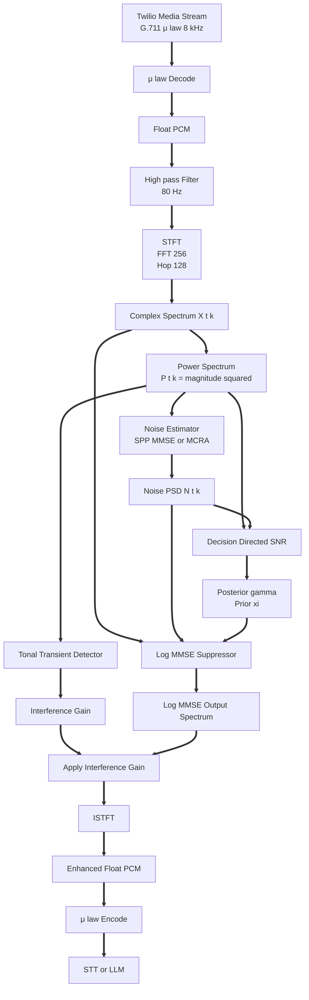
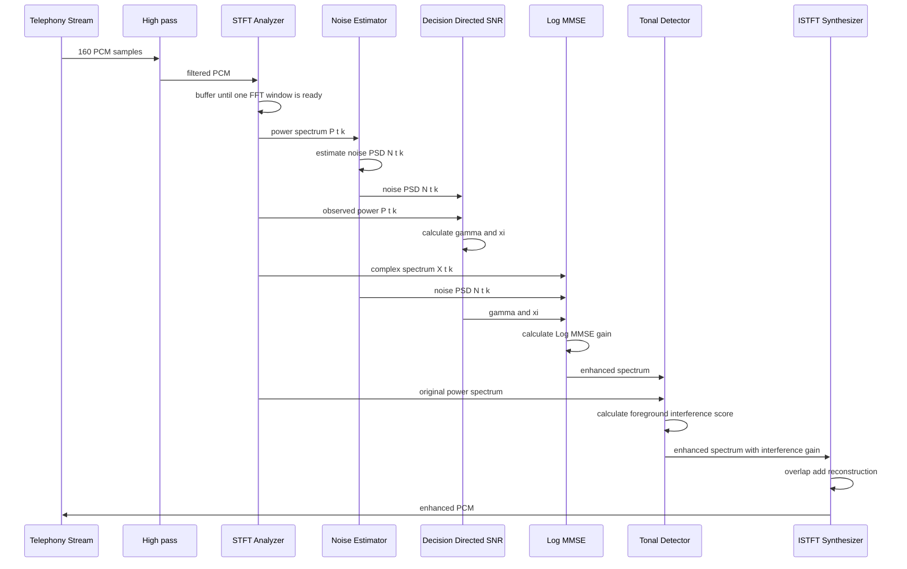

# Noise Cancellation

[](https://app.codacy.com/gh/sghaida/noise-cancelation/dashboard?utm_source=gh&utm_medium=referral&utm_content=&utm_campaign=Badge_grade)
[](https://app.codacy.com/gh/sghaida/noise-cancelation/dashboard?utm_source=gh&utm_medium=referral&utm_content=&utm_campaign=Badge_coverage)

Real-time speech enhancement and noise suppression library written in Go for telephony audio such as Twilio Media Streams.

The project processes mono audio through a modular DSP pipeline that combines noise estimation, statistical speech enhancement, and foreground tonal transient detection.

The current reference configuration targets

```text
Sample rate       8000 Hz
Channels          1 mono
Telephony codec   G.711 μ law
Packet duration   20 ms
Packet samples    160
FFT size          256
Hop size          128
Hop duration      16 ms
One sided bins    129
Bin width         31.25 Hz
Nyquist frequency 4000 Hz
```

The architecture keeps the algorithms independent so implementations can be replaced without changing the full processing pipeline

## Pipeline Overview



The background noise path and the foreground interference path solve different problems

```text
SPP MMSE or MCRA
        ↓
estimate background noise

Log MMSE
        ↓
suppress estimated background noise

Tonal Transient Detector
        ↓
suppress selected strong foreground interference
```

## End to End Capacity Calculation

The end to end benchmark is `BenchmarkEndToEndPipeline100ConcurrentTwoMinutes` in [benchmark/end_to_end_benchmark_test.go](benchmark/end_to_end_benchmark_test.go). Each goroutine owns a complete stateful pipeline and processes shared read-only G.711 μ law packets through decode, high pass, STFT, SPP MMSE, Log MMSE, tonal transient suppression, ISTFT, and μ law encode.

Run the fixed workload with:

```bash
make bench-e2e
```

For the reference configuration, let $C=100$ concurrent calls, $D=120$ seconds per call, $f_s=8000$ samples/second, packet duration $T_p=0.020$ seconds, FFT size $N=256$, and hop size $H=128$ samples.

```math
\begin{aligned}
	ext{packets per call} &= \frac{D}{T_p} = \frac{120}{0.020} = 6000 \\
	ext{samples per call} &= D f_s = 120 \cdot 8000 = 960000 \\
	ext{aggregate audio} &= C D = 100 \cdot 120 = 12000\ \text{seconds} \\
	ext{aggregate samples} &= C D f_s = 100 \cdot 120 \cdot 8000 = 96000000 \\
	ext{packet rate} &= \frac{C}{T_p} = 5000\ \text{packets/second}
\end{aligned}
```

G.711 μ law uses one byte per sample, so the aggregate input is 96,000,000 bytes (96 MB, 91.55 MiB). The encoded output has the same size. The benchmark therefore accounts for 192 MB (183.11 MiB) of codec traffic.

With streaming STFT processing, each call produces:

```math
\begin{aligned}
	ext{complete FFT frames} &= \left\lfloor\frac{960000-N}{H}\right\rfloor + 1 = 7498 \\
	ext{zero-padded flush frames} &= 1 \\
	ext{total spectra} &= 7499 \\
	ext{one-sided bins} &= \frac{N}{2}+1 = 129 \\
	ext{aggregate FFTs} &= C \cdot 7499 = 749900 \\
	ext{aggregate bin visits} &= C \cdot 7499 \cdot 129 = 96737100
\end{aligned}
```

The benchmark reports wall time, total process CPU time, CPU utilization, peak live heap, peak Go runtime memory, and cumulative allocation volume. CPU utilization is calculated as $100 \cdot \text{CPU seconds}/\text{wall seconds}$, so it can exceed 100% when multiple cores are active. The real-time capacity factor is $C D/\text{wall seconds}$; values above 1 mean the measured host can process the aggregate live audio faster than real time.

One reference run on an Apple M5 Pro with Go 1.26.4 produced:

| Measurement | Result |
| --- | ---: |
| Calls and duration | 100 x 120 seconds |
| Wall time | 1.291 seconds |
| Amortized wall time per call-equivalent | 12.91 ms |
| Total CPU time | 23.16 seconds |
| CPU utilization | 1,795% |
| Real-time capacity factor | 9,295x aggregate audio |
| Peak live heap | 14.82 MiB |
| Peak Go runtime memory | 36.74 MiB |
| Cumulative allocations | 2,867 MiB |
| Allocations | 4,292,205 |

These figures are a local performance reference rather than a hardware-independent guarantee. Run `make bench-e2e` on the deployment host when sizing concurrency. The benchmark uses `-benchtime=1x` because one iteration is already the complete 100-call, two-minute workload.

The 12.91 ms value is calculated as $1.291 / 100$ and is an amortized cost per concurrent call-equivalent, not the measured end-to-end latency of one individual call.

## Sequence Diagram



## Algorithm Reference

<!-- markdownlint-disable MD024 -->

### G.711 μ Law Codec

#### Purpose

Twilio Media Streams commonly transport speech as 8 bit G.711 μ law at 8 kHz

The codec converts compressed telephony samples into normalized PCM used by the DSP pipeline and converts enhanced PCM back when needed

#### Equation

The ideal continuous μ law companding function is

```math
F(x)=\mathrm{sgn}(x)\,
\frac{\ln\left(1+\mu |x|\right)}
{\ln\left(1+\mu\right)}
```
with

```math
\mu = 255
```
The implemented codec uses the standard G.711 sign, exponent, and mantissa representation

Normalized decoding is approximately

```math
x_{\mathrm{float}}=
\frac{x_{\mathrm{PCM16}}}{32768}
```
Encoding converts normalized audio back to PCM16 before μ law compression

```math
x_{\mathrm{PCM16}}=
32767\,x_{\mathrm{float}}
```
#### Default Parameters

```text
Sample rate       8000 Hz
Channels          1
Encoded size      8 bits per sample
Packet duration   20 ms
Packet samples    160
Packet bytes      160
```

#### Why

Telephony providers use G.711 because it is simple, low latency, and widely interoperable

The DSP pipeline needs linear PCM because filtering, FFT processing, power estimation, and statistical suppression cannot be performed correctly on μ law compressed bytes

### High Pass Filter

#### Purpose

Remove DC offset, microphone rumble, very low frequency vibration, and energy that does not contribute meaningfully to telephone speech

#### Equation

The implemented first order DC blocking high pass filter is

```math
y[n]
=
x[n]
-
x[n-1]
+
r\,y[n-1]
```
The feedback coefficient is

```math
r=
\exp\left(
-\frac{2\pi f_c}{f_s}
\right)
```
where:

- $x[n]$ is the current input sample
- $y[n]$ is the current output sample
- $f_c$ is the cutoff frequency
- $f_s$ is the sample rate
- $r$ is the feedback coefficient

#### Default Parameters

```text
Sample rate       8000 Hz
Cutoff frequency  80 Hz
```

#### Why

Speech energy below roughly 80 Hz is limited in normal telephone conversation

Removing this region reduces DC offset and low frequency rumble before the FFT and prevents unnecessary low frequency power from affecting the noise estimator

### Hann Window

#### Purpose

Reduce spectral leakage before each FFT

#### Equation

The Hann window is

```math
w[n]
=
\frac{1}{2}
-
\frac{1}{2}
\cos\left(
\frac{2\pi n}{N-1}
\right)
```
for

```math
0 \le n < N
```
The windowed signal is

```math
x_w[n]
=
x[n]\,w[n]
```
#### Default Parameters

```text
Window type  Hann
Window size  256 samples
```

#### Why

An FFT assumes the analyzed block repeats periodically

A raw audio block usually does not join smoothly at its boundaries, which creates artificial frequency leakage

The Hann window smoothly reduces the edges of each FFT frame and makes the resulting spectrum more representative of the real signal

### Short Time Fourier Transform

#### Purpose

Convert short overlapping audio frames from the time domain into the frequency domain

#### Equation

The Short Time Fourier Transform is

```math
X[t,k]
=
\sum_{n=0}^{N-1}
x[tH+n]\,
w[n]\,
e^{-j2\pi kn/N}
```
where:

- $t$ is the frame index
- $k$ is the frequency bin
- $N$ is the FFT size
- $H$ is the hop size
- $w[n]$ is the Hann window

#### Default Parameters

```text
Sample rate  8000 Hz
FFT size     256 samples
Hop size     128 samples
Window       Hann
Overlap      50 percent
```

Derived values

```text
Analysis window   32 ms
Hop duration      16 ms
One sided bins    129
Bin width         31.25 Hz
Nyquist frequency 4000 Hz
```

#### Why

Noise suppression is easier in the time frequency domain

Speech and noise often occupy different frequency regions at different moments

STFT allows the pipeline to estimate noise and calculate a separate gain for every frequency bin in every frame

### Power Spectrum

#### Purpose

Represent the energy of each STFT frequency bin

#### Equation

For a complex FFT bin

```math
X[t,k]
=
\mathrm{Re}\{X[t,k]\}
+
j\,\mathrm{Im}\{X[t,k]\}
```
the power is

```math
P[t,k]
=
|X[t,k]|^2
```
which is

```math
P[t,k]
=
\mathrm{Re}\{X[t,k]\}^2
+
\mathrm{Im}\{X[t,k]\}^2
```
#### Default Parameters

```text
Bins   129 for the 256 point one sided spectrum
Floor  determined by the consuming estimator, normally 1e−12
```

#### Why

Noise estimators and SNR estimators work with energy rather than complex phase

The power spectrum provides the observed energy used by MCRA, SPP MMSE, Decision Directed SNR, and foreground detection

### Minimum Noise Estimator

#### Purpose

Provide a simple noise floor estimator based on smoothed spectral power and minimum tracking

#### Equation

Smoothed power is

```math
S[t,k]
=
\alpha_s S[t-1,k]
+
(1-\alpha_s)P[t,k]
```
The estimated noise is derived from the minimum smoothed value observed inside the configured window

```math
N[t,k]
=
\max\left(
\min_{\tau\in\mathcal{W}_t} S[\tau,k],
N_{\mathrm{floor}}
\right)
```
where $\mathcal{W}_t$ is the active minimum tracking window

#### Default Parameters

```text
Smoothing      0.8
Window frames  50
Floor          1e−12
```

#### Why

Noise frequently appears near the lower envelope of observed spectral power

Minimum tracking is simple, deterministic, and useful as a baseline estimator and for testing more advanced algorithms

It is less effective when noise changes rapidly or when foreground activity continuously covers a frequency region

### MCRA Noise Estimator

#### Purpose

Estimate background noise while reducing updates during likely speech activity

MCRA means Minimum Controlled Recursive Averaging

#### Equation

A smoothed spectrum is calculated

```math
S[t,k]
=
\alpha_s S[t-1,k]
+
(1-\alpha_s)P[t,k]
```
A minimum spectrum is tracked over a moving window

```math
S_{\min}[t,k]
=
\min_{\tau\in\mathcal{W}_t}
S[\tau,k]
```
The ratio between the smoothed spectrum and its minimum is

```math
R[t,k]
=
\frac{S[t,k]}
{S_{\min}[t,k]+\varepsilon}
```
A simple speech activity indicator is derived from the ratio threshold

```math
I[t,k]
=
\begin{cases}
1, & R[t,k]>\delta \\
0, & R[t,k]\le\delta
\end{cases}
```
The speech probability is smoothed over time

```math
p[t,k]
=
\alpha_p p[t-1,k]
+
(1-\alpha_p)I[t,k]
```
The noise estimate is recursively updated

```math
N[t,k]
=
\alpha_n[t,k]N[t-1,k]
+
\left(1-\alpha_n[t,k]\right)P[t,k]
```
#### Default Parameters

```text
Spectrum smoothing            0.8
Speech smoothing              0.2
Noise smoothing               0.95
Ratio threshold               5
Window frames                 50
Baseline duration             5 seconds
Sample rate                   8000 Hz
Hop size                      128 samples
Minimum probability frequency 80 Hz
Floor                         1e−12
```

#### Why

Pure minimum tracking reacts slowly to changing noise

MCRA improves tracking while trying not to learn active speech as noise

It is useful for stationary and slowly changing environments

A limitation is that strong foreground interference such as a bird or alarm may be interpreted as foreground activity and therefore protected

### SPP MMSE Noise Estimator

#### Purpose

Estimate changing background noise using speech presence probability and a conditional MMSE noise estimate

SPP means Speech Presence Probability

MMSE means Minimum Mean Square Error

#### Equation

The posterior power ratio is

```math
\gamma[t,k]
=
\frac{P[t,k]}
{N[t-1,k]}
```
The speech presence probability is

```math
p[t,k]
=
\left[
1
+
\frac{1-q}{q}
\left(1+\xi_{H_1}\right)
\exp\left(
-\frac{
\gamma[t,k]\xi_{H_1}
}{
1+\xi_{H_1}
}
\right)
\right]^{-1}
```
where $q=P(H_1)$ is the prior probability of speech presence and $\xi_{H_1}$ is the fixed prior SNR under the foreground-present hypothesis

The probability is smoothed

```math
\bar{p}[t,k]
=
\alpha_p\bar{p}[t-1,k]
+
(1-\alpha_p)p[t,k]
```
The conditional MMSE noise periodogram is

```math
N_{\mathrm{MMSE}}[t,k]
=
(1-p[t,k])P[t,k]
+
p[t,k]N[t-1,k]
```
The final noise PSD is recursively smoothed

```math
N[t,k]
=
\alpha_n N[t-1,k]
+
(1-\alpha_n)N_{\mathrm{MMSE}}[t,k]
```
#### Default Parameters

```text
Noise smoothing          0.8
SPP smoothing            0.9
Speech prior             0.5
Fixed prior SNR          31.6227766
Fixed prior SNR in dB    15 dB
Stagnation threshold     0.99
Maximum speech probability 0.99
Floor                    1e−12
```

#### Why

SPP MMSE can track changing environmental noise faster than a minimum based estimator

It uses a probabilistic estimate of foreground presence rather than only a moving minimum

The fixed 15 dB prior makes the SPP calculation stable and independent from the later Decision Directed SNR calculation

A limitation is that SPP does not know whether foreground activity is wanted human speech or unwanted foreground sound

A bird chirp can produce

```text
SPP close to 1
```

because it clearly differs from the estimated background noise

That is the reason foreground tonal transient detection exists as a separate stage

### Decision Directed SNR Estimator

#### Purpose

Estimate posterior and prior SNR for statistical speech suppression while reducing frame to frame gain instability

#### Equation

Posterior SNR is

```math
\gamma[t,k]
=
\frac{P[t,k]}
{N[t,k]}
```
Instantaneous prior SNR evidence is

```math
\xi_{\mathrm{inst}}[t,k]
=
\max\left(
\gamma[t,k]-1,
0
\right)
```
The previous clean SNR is

```math
\xi_{\mathrm{clean}}[t-1,k]
=
\frac{
\widehat{S}[t-1,k]
}{
N[t-1,k]
}
```
The Decision Directed prior SNR is

```math
\xi[t,k]
=
\alpha\,\xi_{\mathrm{clean}}[t-1,k]
+
(1-\alpha)\xi_{\mathrm{inst}}[t,k]
```
#### Default Parameters

```text
Alpha  0.98
Floor  1e−12
```

#### Why

Using only the current frame causes large SNR changes and unstable suppression gains

The Decision Directed method combines the previous enhanced estimate with current evidence

The high alpha value of 0.98 strongly favors temporal continuity while still allowing the estimator to react to new speech energy

### Log MMSE Suppressor

#### Purpose

Suppress estimated background noise while preserving speech spectral structure

#### Equation

The effective noise PSD is

```math
N_{\mathrm{effective}}[t,k]
=
\beta N[t,k]
```
The intermediate variable is

```math
v[t,k]
=
\frac{
\gamma[t,k]\xi[t,k]
}{
1+\xi[t,k]
}
```
The Log MMSE gain is

```math
G[t,k]
=
\frac{
\xi[t,k]
}{
1+\xi[t,k]
}
\exp\left(
\frac{1}{2}E_1\left(v[t,k]\right)
\right)
```
where $E_1(\cdot)$ is the exponential integral

The enhanced spectrum is

```math
Y[t,k]
=
G[t,k]X[t,k]
```
The clean power estimate is

```math
\widehat{S}[t,k]
=
G[t,k]^2P[t,k]
```
#### Default Parameters

```text
Minimum gain          0.05
Maximum gain          1
Floor                 1e−12
Noise overestimation  1.25
```

#### Why

Log MMSE is designed to estimate clean speech in the logarithmic spectral domain

It generally produces smoother and more natural speech than hard spectral subtraction

The noise overestimation factor of 1.25 provides slightly more conservative suppression when the noise estimator underestimates the real background level

The minimum gain prevents bins from being completely removed, which reduces musical noise and unnatural holes in the spectrum

### Tonal Prominence Detector

#### Purpose

Detect narrow foreground tones such as bird chirps, whistles, alarms, and some machine tones that background noise estimators may protect

#### Equation

The detector estimates the local background from side bins outside the FFT main lobe

```math
\mathcal{B}_k
=
\{k-6,\ldots,k-3\}
\cup
\{k+3,\ldots,k+6\}
```
The local background power is

```math
P_{\mathrm{background}}[t,k]
=
\frac{1}{|\mathcal{B}_k|}
\sum_{i\in\mathcal{B}_k}
P[t,i]
```
Tonal prominence in dB is

```math
T_{\mathrm{dB}}[t,k]
=
10\log_{10}
\left(
\frac{
P[t,k]
}{
P_{\mathrm{background}}[t,k]+\varepsilon
}
\right)
```
The normalized tonal score is

```math
T_{\mathrm{score}}
=
\begin{cases}
0, & T_{\mathrm{dB}}\le T_{\mathrm{start}} \\
1, & T_{\mathrm{dB}}\ge T_{\mathrm{full}} \\
\dfrac{
T_{\mathrm{dB}}-T_{\mathrm{start}}
}{
T_{\mathrm{full}}-T_{\mathrm{start}}
},
& \mathrm{otherwise}
\end{cases}
```
#### Default Parameters

```text
Guard bins       2
Search bins      6
Tonal start      5 dB
Tonal full       14 dB
Floor            1e−12
```

#### Why

A strong narrow tone creates a local spectral peak

The immediate neighboring bins cannot be used as the background because the Hann window spreads a sinusoid into nearby FFT bins

Using farther side bins produces a better estimate of how prominent the tone really is

### Positive Spectral Flux

#### Purpose

Detect sudden frequency energy that appears from one STFT frame to the next

#### Equation

Positive spectral flux in dB is

```math
F_{\mathrm{dB}}[t,k]
=
\max\left(
10\log_{10}
\left(
\frac{
P[t,k]
}{
P[t-1,k]+\varepsilon
}
\right),
0
\right)
```
The normalized flux score is

```math
F_{\mathrm{score}}
=
\begin{cases}
0, & F_{\mathrm{dB}}\le F_{\mathrm{start}} \\
1, & F_{\mathrm{dB}}\ge F_{\mathrm{full}} \\
\dfrac{
F_{\mathrm{dB}}-F_{\mathrm{start}}
}{
F_{\mathrm{full}}-F_{\mathrm{start}}
},
& \mathrm{otherwise}
\end{cases}
```
#### Default Parameters

```text
Flux start  3 dB
Flux full   18 dB
Floor       1e−12
```

#### Why

Keyboard clicks, door events, bird onsets, and other unexpected sounds often appear suddenly

Positive spectral flux gives strong evidence that a tonal peak is a new event rather than a stable speech harmonic that has existed for many frames

### Frequency Movement Detector

#### Purpose

Detect tonal peaks that move across frequency bins over consecutive frames

#### Equation

The detector searches the configured neighborhood in the previous frame

```math
k_{\mathrm{prev}}
=
\underset{
i\in[k-R_m,\;k+R_m]
}{
\mathrm{arg\,max}
}
P[t-1,i]
```
Movement distance is

```math
D[t,k]
=
|k-k_{\mathrm{prev}}|
```
The normalized movement score is

```math
M_{\mathrm{score}}
=
\begin{cases}
0, & D\le D_{\mathrm{start}} \\
1, & D\ge D_{\mathrm{full}} \\
\dfrac{
D-D_{\mathrm{start}}
}{
D_{\mathrm{full}}-D_{\mathrm{start}}
},
& \mathrm{otherwise}
\end{cases}
```
#### Default Parameters

```text
Movement search radius       6 bins
Movement start               1 bin
Movement full                4 bins
Minimum relative prior power 0.1
```

At the current FFT size

```math
1\ \mathrm{bin}
=
31.25\ \mathrm{Hz}
```
```math
4\ \mathrm{bins}
=
125\ \mathrm{Hz}
```
#### Why

Bird chirps and whistles often sweep in frequency

A moving narrow tone is more suspicious than a stable group of harmonically related speech components

### Harmonic Speech Protection

#### Purpose

Protect voiced speech from being mistaken for tonal interference

#### Equation

For a detected bin $k$ the detector examines related harmonic and subharmonic positions

```math
\mathcal{H}_k
=
\left\{
\frac{k}{2},
\frac{k}{3},
\frac{k}{4},
2k,
3k,
4k
\right\}
```
For related power $P_r$ the relation score is

```math
H_r[t,k]
=
\min\left(
\frac{
P_r[t]
}{
\rho_H P[t,k]
},
1
\right)
```
The final harmonic support is

```math
H[t,k]
=
\max_{r\in\mathcal{H}_k}
H_r[t,k]
```
where $\rho_H$ is the configured harmonic relative power

#### Default Parameters

```text
Harmonic tolerance       1 bin
Harmonic relative power  0.15
```

#### Why

Human voiced speech contains harmonic structure

Suppressing every narrow peak would damage vowels and voiced consonants

Strong related harmonic energy increases H toward 1 and therefore protects that bin from foreground attenuation

### Persistent Tonal Evidence

#### Purpose

Keep detecting a narrow interfering tone after its initial onset has passed

#### Equation

Persistent tonal evidence is

```math
P_{\mathrm{tone}}[t,k]
=
0.35\,T_{\mathrm{score}}[t,k]
```
The temporal score is

```math
Q[t,k]
=
\max\left(
F_{\mathrm{score}}[t,k],
M_{\mathrm{score}}[t,k],
P_{\mathrm{tone}}[t,k]
\right)
```
#### Default Parameters

```text
Persistent tonal weight  0.35
```

#### Why

A bird tone or alarm can remain in the same FFT bin for several frames

After the first frame its spectral flux may become zero and its movement may also become zero

Without persistent tonal evidence the interference score would immediately collapse to zero even though the unwanted tone is still audible

### Tonal Transient Interference Score

#### Purpose

Combine multiple clues into one foreground interference confidence value

#### Equation

The foreground interference score is

```math
S_{\mathrm{interference}}[t,k]
=
T_{\mathrm{score}}[t,k]\,
Q[t,k]\,
\left(
1-H[t,k]
\right)
```
The score is clamped to

```math
0
\le
S_{\mathrm{interference}}[t,k]
\le
1
```
The target interference gain is

```math
G_{\mathrm{target}}[t,k]
=
\max\left(
G_{\min},
1-\lambda S_{\mathrm{interference}}[t,k]
\right)
```
where $\lambda$ is the configured suppression strength

#### Default Parameters

```text
Strength      0.5
Minimum gain  0.5
```

The minimum gain of 0.5 corresponds to a maximum tonal detector attenuation of approximately

```math
20\log_{10}(0.5)
\approx
-6.02\ \mathrm{dB}
```
#### Why

No single acoustic feature is safe enough on its own

Tonality alone can match speech harmonics

Flux alone can match consonants

Movement alone can match natural speech pitch changes

Combining tonal evidence, temporal evidence, and harmonic protection greatly reduces false detections

The current 6 dB limit is deliberately conservative to protect speech while the detector is tuned

### Attack and Release Gain Smoothing

#### Purpose

Prevent abrupt frame to frame gain changes that would create clicks and musical artifacts

#### Equation

When attenuation needs to increase

```math
G[t,k]
=
\alpha_{\mathrm{attack}}G[t-1,k]
+
\left(
1-\alpha_{\mathrm{attack}}
\right)
G_{\mathrm{target}}[t,k]
```
When attenuation needs to decrease

```math
G[t,k]
=
\alpha_{\mathrm{release}}G[t-1,k]
+
\left(
1-\alpha_{\mathrm{release}}
\right)
G_{\mathrm{target}}[t,k]
```
#### Default Parameters

```text
Attack   0.3
Release  0.85
```

#### Why

A lower attack coefficient lets suppression engage relatively quickly

A higher release coefficient makes recovery slower and smoother

This avoids rapid gain pumping around transient events

### Neighbor Gain Spreading

#### Purpose

Avoid suppressing exactly one FFT bin while leaving adjacent bins untouched

#### Equation

For distance $d$ from the detected center and spread radius $R$

```math
w_d
=
\frac{
R-d+1
}{
R+1
}
```
The neighbor gain is

```math
G_{\mathrm{neighbor}}
=
1
-
\left(
1-G_{\mathrm{center}}
\right)
w_d
```
#### Default Parameters

```text
Spread radius  2 bins
```

At 31.25 Hz per bin this affects roughly

```math
\pm 62.5\ \mathrm{Hz}
```
around the center bin

#### Why

A real sinusoid occupies more than one FFT bin because of the analysis window

Soft spreading reduces ringing and avoids creating an unnatural spectral hole

### Apply Interference Gain

#### Purpose

Apply the foreground detector gain to the spectrum produced by Log MMSE

#### Equation

The final complex spectrum is

```math
Y_{\mathrm{final}}[t,k]
=
G_{\mathrm{interference}}[t,k]\,
Y_{\mathrm{LogMMSE}}[t,k]
```
The final power is

```math
P_{\mathrm{final}}[t,k]
=
G_{\mathrm{interference}}[t,k]^2
P_{\mathrm{LogMMSE}}[t,k]
```
The combined amplitude gain is approximately

```math
G_{\mathrm{final}}[t,k]
=
G_{\mathrm{LogMMSE}}[t,k]\,
G_{\mathrm{interference}}[t,k]
```
#### Default Parameters

```text
Gain range  MinGain through 1
```

#### Why

The tonal detector and Log MMSE solve different problems

Log MMSE suppresses background noise

The interference gain suppresses selected strong foreground tones

Keeping the stages separate makes tuning and debugging easier

### Inverse STFT

#### Purpose

Convert the enhanced complex spectra back into continuous time domain PCM

#### Equation

Each processed frame is transformed with an inverse FFT

```math
\widetilde{x}_t[n]
=
\mathrm{Re}
\left\{
\mathrm{IFFT}
\left(
Y[t,k]
\right)
\right\}
```
The synthesis window is applied and overlapping frames are accumulated

```math
x_{\mathrm{sum}}[n]
=
\sum_t
\widetilde{x}_t[n-tH]\,
w[n-tH]
```
The overlap weight is accumulated

```math
W[n]
=
\sum_t
w[n-tH]^2
```
The normalized reconstructed signal is

```math
\widehat{x}[n]
=
\frac{
x_{\mathrm{sum}}[n]
}{
W[n]
}
```
for $W[n]>0$

#### Default Parameters

```text
FFT size   256
Hop size   128
Window     Hann
Overlap    50 percent
```

#### Why

STFT processing changes spectral bins independently

ISTFT reconstructs those processed frames into continuous audio

Window weight normalization compensates for overlap so the output amplitude remains stable

<!-- markdownlint-enable MD024 -->

## Baseline Noise Learning

The noise estimators support an explicit baseline phase

For controlled smoke tests the first 5 seconds contain environment noise without desired speech

Start the baseline before processing the first STFT frame

```go
noiseEstimator.StartBaseline()
```

Process baseline frames normally

When the first complete FFT frame extends beyond the baseline region finish baseline learning

```go
noiseEstimator.FinishBaseline()
```

At 8 kHz with a 128 sample hop

```math
\frac{8000}{128}
=
62.5\ \mathrm{frames/s}
```
Five seconds corresponds to approximately

```math
5\times 62.5
=
312.5\ \mathrm{hop\ intervals}
```
Only complete FFT windows that remain fully inside the five second baseline should be included

## How To Use

## Pipeline

The pipeline is the main entry point for real time speech enhancement

It owns the complete DSP state and accepts PCM buffers as input while returning enhanced PCM buffers as output

### Install

```bash
go get github.com/sghaida/noise-cancelation
```

### Pipeline API

The complete DSP pipeline should be exposed as a stateful processor that accepts PCM input and returns all enhanced PCM currently available

Because the STFT analyzer buffers samples internally, one call to `Process` does not necessarily return the same number of samples that were provided

With the reference configuration

```text
Incoming Twilio packet  160 samples
FFT size                256 samples
Hop size                128 samples
```

the pipeline may return

```text
0 samples
128 samples
256 samples
```

depending on how many STFT frames became available after the new input was added

The caller should therefore treat the returned slice as an output stream rather than expecting a one to one packet mapping

### Pipeline Structure

Create

```text
pipeline/
    pipeline.go
```

The pipeline owns all stateful DSP components

```go
package pipeline

import (
    "fmt"

    "github.com/sghaida/noise-cancelation/audio"
    "github.com/sghaida/noise-cancelation/dsp/highpass"
    "github.com/sghaida/noise-cancelation/dsp/interference"
    "github.com/sghaida/noise-cancelation/dsp/noise"
    "github.com/sghaida/noise-cancelation/dsp/snr"
    "github.com/sghaida/noise-cancelation/dsp/stft"
    "github.com/sghaida/noise-cancelation/dsp/suppressor"
)

// Config configures the complete speech enhancement pipeline
type Config struct {
    SampleRate       int
    FFTSize          int
    HopSize          int
    HighPassCutoffHz float32
    BaselineSeconds  float32
}

// DefaultConfig returns the default telephony pipeline configuration
func DefaultConfig() Config {
    return Config{
        SampleRate:       8000,
        FFTSize:          256,
        HopSize:          128,
        HighPassCutoffHz: 80,
        BaselineSeconds:  5,
    }
}

// Pipeline contains the complete stateful speech enhancement pipeline
type Pipeline struct {
    cfg Config

    highPass       *highpass.Filter
    analyzer       *stft.Analyzer
    synthesizer    *stft.Synthesizer
    noiseEstimator *noise.SPPMMSEEstimator
    logMMSE        *suppressor.LogMMSE
    tonalDetector  *interference.TonalTransientDetector

    frameCount       int
    baselineSamples  int
    baselineFinished bool
}
```

### Create The Pipeline

```go
// New creates a complete speech enhancement pipeline
func New(cfg Config) (*Pipeline, error) {
    if cfg.SampleRate <= 0 {
        return nil, fmt.Errorf("sample rate must be greater than zero")
    }

    if cfg.FFTSize <= 0 {
        return nil, fmt.Errorf("FFT size must be greater than zero")
    }

    if cfg.HopSize <= 0 {
        return nil, fmt.Errorf("hop size must be greater than zero")
    }

    analyzer, err := stft.New(cfg.FFTSize, cfg.HopSize)
    if err != nil {
        return nil, fmt.Errorf("create STFT analyzer: %w", err)
    }

    synthesizer, err := stft.NewSynthesizer(cfg.FFTSize, cfg.HopSize)
    if err != nil {
        return nil, fmt.Errorf("create ISTFT synthesizer: %w", err)
    }

    noiseEstimator := noise.NewSPPMMSEEstimator(noise.DefaultSPPMMSEConfig())

    noiseEstimator.StartBaseline()

    logMMSE := suppressor.NewLogMMSE(
        suppressor.DefaultLogMMSEConfig(),
        snr.DefaultDecisionDirectedConfig(),
    )

    tonalDetector := interference.NewTonalTransientDetector(
        interference.DefaultTonalTransientConfig(),
    )

    baselineSamples := int(cfg.BaselineSeconds * float32(cfg.SampleRate))

    return &Pipeline{
        cfg: cfg,
        highPass: highpass.New(cfg.SampleRate, cfg.HighPassCutoffHz),
        analyzer:       analyzer,
        synthesizer:    synthesizer,
        noiseEstimator: noiseEstimator,
        logMMSE:        logMMSE,
        tonalDetector:  tonalDetector,
        baselineSamples: baselineSamples,
    }, nil
}
```

### Process Incoming PCM

`Process` accepts one PCM chunk and returns all enhanced PCM samples currently available

```go
// Process processes one incoming PCM chunk and returns all PCM samples
// currently available from the enhancement pipeline
//
// The returned slice may contain zero or more samples because the STFT
// analyzer buffers input internally until a complete spectral frame exists
func (p *Pipeline) Process(samples []float32) ([]float32, error) {
    if len(samples) == 0 {
        return nil, nil
    }

    filtered, err := p.highPass.Process(samples)
    if err != nil {
        return nil, fmt.Errorf( "high pass: %w", err)
    }

    spectra, err := p.analyzer.Process(filtered)
    if err != nil {
        return nil, fmt.Errorf( "STFT: %w", err)
    }

    var output []float32

    for i := range spectra {
        pcm, err := p.processSpectrum(spectra[i])
        if err != nil {
            return nil, err
        }

        output = append(output, pcm...)
    }

    return output, nil
}
```

### Process One Spectrum

The spectral pipeline is

```text
Power Spectrum
        ↓
SPP MMSE
        ↓
Noise PSD
        ↓
Decision Directed SNR
        ↓
Log MMSE
        ↓
Tonal Transient Detector
        ↓
Apply Interference Gain
        ↓
ISTFT
```

The tonal detector inspects the original STFT power before Log MMSE changes the spectrum

Its gain is applied to the spectrum produced by Log MMSE

```go
func (p *Pipeline) processSpectrum(spectrum audio.Spectrum) ([]float32, error) {
    frameStartSample := p.frameCount * p.cfg.HopSize
    frameEndSample := frameStartSample + p.cfg.FFTSize
    isBaseline := frameEndSample <= p.baselineSamples

    if !isBaseline && !p.baselineFinished {
        p.noiseEstimator.FinishBaseline()
        p.tonalDetector.Reset()
        p.baselineFinished = true
    }

    power := spectrum.RecomputePower()

    noisePSD := p.noiseEstimator.Process(power)

    outputSpectrum := spectrum

    if !isBaseline {
        interferenceResult := p.tonalDetector.Process(power)

        var err error

        outputSpectrum, err = p.logMMSE.Process(spectrum, noisePSD)

        if err != nil {
            return nil, fmt.Errorf("Log MMSE frame %d: %w", p.frameCount, err)
        }

        if err := interference.ApplyGain(&outputSpectrum, interferenceResult.Gain); err != nil {
            return nil, fmt.Errorf( "interference gain frame %d: %w", p.frameCount, err)
        }
    }

    pcm, err := p.synthesizer.Process(outputSpectrum)

    if err != nil {
        return nil, fmt.Errorf("ISTFT frame %d: %w", p.frameCount, err)
    }

    p.frameCount++

    return pcm, nil
}
```

### Flush

When the call or audio stream ends, flush any remaining STFT and ISTFT state

```go
// Flush processes remaining buffered audio and returns the final PCM samples
func (p *Pipeline) Flush() ([]float32, error) {
    spectra, err := p.analyzer.Flush()

    if err != nil {
        return nil, fmt.Errorf( "flush STFT: %w", err )
    }

    var output []float32

    for i := range spectra {
        pcm, err := p.processSpectrum(spectra[i])

        if err != nil {
            return nil, err
        }

        output = append(output, pcm...)
    }

    remaining := p.synthesizer.Flush()
    output = append(output, remaining...)

    return output, nil
}
```

### Reset

Reset the complete pipeline before processing a different call

```go
// Reset clears all temporal state so the pipeline can process a new stream
func (p *Pipeline) Reset() {
    p.highPass.Reset()
    p.analyzer.Reset()
    p.synthesizer.Reset()
    p.noiseEstimator.Reset()
    p.logMMSE.Reset()
    p.tonalDetector.Reset()

    p.frameCount = 0
    p.baselineFinished = false

    p.noiseEstimator.StartBaseline()
}
```

### Application Usage

The application only needs to create one processor and continuously pass incoming PCM into it

```go
func main() {
    processor, err := pipeline.New(pipeline.DefaultConfig())

    if err != nil {
        log.Fatal(err)
    }

    for {
        input := readNextAudioChunk()
        output, err := processor.Process(input)

        if err != nil {
            log.Fatal(err)
        }

        if len(output) > 0 {
            sendToOutput(output)
        }
    }
}
```

`sendToOutput` represents whichever component consumes the enhanced PCM

Examples include

```text
OpenAI Realtime
speech to text
another audio stream
WAV writer
network socket
test harness
```

### Production Buffer API

The simple `Process` method above may allocate because it appends returned PCM into a new output slice

For a production real time pipeline the preferred API accepts a reusable destination buffer

```go
func (p *Pipeline) Process(dst []float32, src []float32) ([]float32, error)
```

The caller can reuse the same backing memory

```go
output = output[:0]

output, err = processor.Process(output, input)

if err != nil {
    return err
}

if len(output) > 0 {
    sendToOutput(output)
}
```

This design allows the pipeline wrapper to follow the same steady state goal as the DSP algorithms

```text
0 B per operation
0 allocations per operation
```

## Twilio Media Streams

A typical Twilio media frame contains

```text
Codec       G.711 μ law
Sample rate 8000 Hz
Channels    1
Duration    20 ms
Samples     160
Bytes       160 before base64 transport
```

Recommended processing path

```text
Twilio base64 payload
        ↓
base64 decode
        ↓
μ law decode
        ↓
160 float PCM samples
        ↓
High pass
        ↓
STFT buffering
        ↓
Noise estimation
        ↓
Log MMSE
        ↓
Tonal transient suppression
        ↓
ISTFT
        ↓
enhanced PCM
        ↓
STT or LLM
```

The 160 sample network packet size does not need to match the 256 sample FFT size

The STFT analyzer keeps its own internal buffer and emits frames whenever enough samples are available

## Reset Between Calls

Every stateful DSP component must be reset before it is reused for a different call

```go
tonalDetector.Reset()
logMMSE.Reset()
noiseEstimator.Reset()
synthesizer.Reset()
analyzer.Reset()
highPass.Reset()
```

This prevents one caller's noise statistics, SNR history, or interference history from affecting another caller

## Smoke Tests

Smoke tests are intentionally excluded from normal unit test execution

Run the available smoke tests with

```bash
make smoke-highpass
make smoke-stft
make smoke-mcra
make smoke-sppmmse
make smoke-logmmse
make smoke-tonal-transient
```

To run only the tonal transient pipeline directly

```bash
go test -tags=smoke ./smoke -run TestTonalTransientPipelineSmoke -v
```

Typical generated outputs

```text
smoke/output/highpass.out.wav
smoke/output/stft_istft.out.wav
smoke/output/mcra.out.csv
smoke/output/sppmmse.out.wav
smoke/output/sppmmse.out.csv
smoke/output/logmmse.out.wav
smoke/output/logmmse.out.csv
smoke/output/tonal_transient.out.wav
smoke/output/tonal_transient.out.csv
```

The WAV output is used for listening tests

The CSV output is used to inspect the algorithm state for exact times and frequency bins

Useful tonal pipeline columns

```text
time_seconds
frame
phase
bin
frequency_hz
observed_power
spp_noise_power
speech_presence_probability
effective_noise_power
gamma
xi
logmmse_gain
tonal_prominence_db
spectral_flux_db
harmonic_support
movement_score
interference_score
interference_gain
final_gain
output_power
attenuation_db
```

## Unit Tests

Run normal unit tests

```bash
make test
```

Run race tests

```bash
make test-race
```

Generate the full statement coverage report

```bash
make coverage
```

Enforce the repository's 95 percent minimum statement coverage

```bash
make cover-check
```

A useful target for the low-level DSP packages is greater than 95 percent statement coverage

Important defensive cases include

```text
zero power
negative power
NaN
Inf
buffer size changes
invalid configuration
minimum gain
reset behavior
empty input
```

## Benchmarks

Run all benchmarks

```bash
make bench
```

Run longer repeated benchmarks

```bash
make bench-all
```

Run interference benchmarks

```bash
go test ./dsp/interference -bench TonalTransient -benchmem -run '^$'
```

Current measured results

The following results were measured on `darwin/arm64` using an Apple M5 Pro
Each value below is the arithmetic mean of the three runs shown by the benchmark output
Initialization benchmarks measure construction and steady state benchmarks measure the warmed up processing path

| Package | Benchmark | Mean time | Memory | Allocations |
| --- | --- | ---: | ---: | ---: |
| `audio` | RMS, 160 samples | 42.15 ns | 0 B | 0 |
| `audio` | RMS, 960 samples | 219.57 ns | 0 B | 0 |
| `audio` | EnsurePower, 256 FFT | 44.34 ns | 0 B | 0 |
| `audio` | EnsurePower, 2048 FFT | 334.37 ns | 0 B | 0 |
| `stft` | STFT process, 160-sample chunk | 3.117 microseconds | 2,296 B | 3 |
| `stft` | STFT process, 128-sample hop | 2.484 microseconds | 1,840 B | 3 |
| `stft` | STFT initialization | 1.013 microseconds | 5,216 B | 4 |
| `stft` | ISTFT process | 2.808 microseconds | 512 B | 1 |
| `stft` | ISTFT initialization | 1.038 microseconds | 5,248 B | 5 |
| `noise` | MCRA process | 431.5 ns | 0 B | 0 |
| `noise` | MCRA speech probability | 76.70 ns | 0 B | 0 |
| `noise` | MCRA initialization | 502.73 ns | 3,696 B | 7 |
| `noise` | SPP MMSE process | 882.23 ns | 0 B | 0 |
| `noise` | SPP MMSE speech probability | 4.254 ns | 0 B | 0 |
| `noise` | SPP MMSE initialization | 358.93 ns | 2,880 B | 4 |
| `interference` | Tonal transient process | 619.23 ns | 0 B | 0 |
| `interference` | Tonal transient, moving tone | 620.53 ns | 0 B | 0 |
| `interference` | Tonal transient, flat spectrum | 580.77 ns | 0 B | 0 |
| `interference` | Tonal transient gain application | 123.63 ns | 0 B | 0 |
| `interference` | Tonal transient initialization | 684.30 ns | 4,928 B | 9 |

The benchmark output also measured these MCRA and SPP MMSE baseline paths:

```text
MCRA baseline process       433.20 ns/op   0 B/op   0 allocs/op
MCRA baseline update         87.60 ns/op   0 B/op   0 allocs/op
SPP MMSE baseline update    161.07 ns/op   0 B/op   0 allocs/op
```

The Log MMSE, decision-directed SNR, high-pass, codec, and complete pipeline stages were not included in the supplied benchmark output
They must be measured separately before these results can be treated as an end-to-end benchmark

At 8 kHz with a 128 sample hop

```math
\frac{8000}{128}
=
62.5\ \mathrm{frames/s}
```
The hot DSP stages therefore use only a small fraction of the available 16 ms frame interval

### 100 Concurrent Two Minute Calls

The following is a capacity estimate from the measured stages above, not an end-to-end CPU or RSS measurement
It assumes one independent stateful pipeline instance per call, 20 ms input chunks, 8 kHz audio, a 128-sample hop, and the SPP MMSE path

At the reference configuration:

```math
\mathrm{input\ chunks\ per\ second}
=
\frac{8000}{160}
=
50
```
```math
\mathrm{spectral\ frames\ per\ second}
=
\frac{8000}{128}
=
62.5
```
For one call, the directly measured CPU time per wall-clock second is:

```math
\begin{aligned}
T_{\mathrm{SPP}} &= 50(3.117\ \mu s) \\
&\quad + 62.5(0.882+0.619+0.124+2.808)\ \mu s \\
&= 432.9\ \mu s/s
\end{aligned}
```
The terms are STFT, SPP MMSE, tonal transient processing, interference gain application, and ISTFT
The power recomputation, high-pass, codec, SNR, Log MMSE, pipeline wrapper, scheduling, and I/O are excluded because matching benchmark results were not supplied

For 100 concurrent calls lasting 120 seconds:

| Estimate | Calculation | Result |
| --- | --- | ---: |
| CPU utilization equivalent | `100 x 432.9 microseconds/s` | 43.29 ms CPU/s, or **4.33% of one logical core** |
| CPU time over the call interval | `43.29 ms/s x 120 s` | **5.19 CPU-seconds** |
| SPP steady-state allocations | `100 x (50 x 2,296 + 62.5 x 512) B/s` | **14.68 MB/s allocated** |
| SPP steady-state allocations over two minutes | `14.68 MB/s x 120 s` | **1.76 GB allocated transiently** |

The MCRA alternative changes only the noise-estimator term:

```math
50(3.117\ \mu s)
+
62.5(0.432+0.619+0.124+2.808)\ \mu s
=
404.8\ \mu s/s
```
That is approximately **4.05% of one logical core for 100 concurrent calls**, or **4.86 CPU-seconds over 120 seconds**, before the same unmeasured stages are added

### Memory Estimate

The measured initialization allocations provide a lower bound for persistent DSP state per call

```text
SPP MMSE path
    STFT              5,216 B
    ISTFT             5,248 B
    SPP MMSE          2,880 B
    Tonal detector    4,928 B
    Measured subtotal 18,272 B per call

MCRA path
    STFT              5,216 B
    ISTFT             5,248 B
    MCRA              3,696 B
    Tonal detector    4,928 B
    Measured subtotal 19,088 B per call
```

For 100 calls, those measured state subtotals are approximately **1.74 MiB for SPP MMSE** or **1.82 MiB for MCRA**
They exclude Log MMSE, SNR, high-pass, codec, pipeline wrapper objects, Go runtime overhead, goroutine stacks, transport buffers, and application buffers

The steady-state allocation numbers are not resident memory
They describe how much short-lived memory the benchmark allocates over time and therefore indicate garbage collector workload
The benchmarked STFT and ISTFT paths allocate approximately 17.62 MB per call during a two-minute call, or approximately **1.76 GB of cumulative transient allocation for 100 calls**
The actual resident set depends on garbage collection timing and runtime configuration

If an application retains the entire audio stream instead of processing it incrementally, the storage requirement is much larger
Two minutes at 8 kHz contains 960,000 samples:

```text
One call, μ-law bytes       960,000 B   about 0.92 MiB
One call, float32 PCM     3,840,000 B   about 3.66 MiB
100 calls, both formats 480,000,000 B   about 457.76 MiB
```

The streaming pipeline should not retain those complete call buffers
It should retain only bounded input, spectral, overlap-add, output, and transport buffers

## Real Time Memory Design

Steady state DSP processing should reuse buffers

```text
allocate once
    ↓
process every frame
    ↓
0 B per operation
0 allocations per operation
```

Reusable state includes

```text
FFT scratch memory
noise PSD
speech probabilities
gamma
xi
previous clean power
previous clean SNR
interference scores
interference gain
ISTFT overlap buffers
```

Initialization allocations are acceptable because they happen once per call

## Current Limitations

## Strong Foreground Noise

Noise estimators answer approximately

```text
does this signal match the estimated background noise
```

They do not answer

```text
is this wanted human speech
```

A strong bird chirp can therefore produce

```text
SPP close to 1
gamma very high
xi very high
Log MMSE gain close to 1
```

The tonal transient stage helps with narrow foreground interference but it is not a general semantic source separator

## Another Human Speaker

When two people speak at the same time both signals contain valid speech structure

A classical single channel suppressor cannot reliably know which speaker should be preserved

That problem requires target speaker extraction, source separation, speaker conditioning, or multiple microphone spatial processing

## 8 kHz Telephony

At an 8 kHz sample rate

```math
f_{\mathrm{Nyquist}}
=
\frac{f_s}{2}
=
4000\ \mathrm{Hz}
```
No audio information exists above 4 kHz

Upsampling an 8 kHz telephone signal does not recreate the missing frequency content

Algorithms should therefore be evaluated with genuine telephony bandwidth when telephony is the deployment target

## Design Principles

## Replaceable Algorithms

The project keeps major DSP stages behind replaceable components

```text
Codec
Filter
Noise Estimator
SNR Processor
Suppressor
Interference Detector
```

This allows future implementations to be added without changing the complete pipeline

## Observable DSP

Listening alone is not enough to tune complex speech enhancement

The smoke tests therefore produce both WAV and CSV output

Recommended development cycle

```text
run fixture
    ↓
listen to output WAV
    ↓
identify a bad timestamp
    ↓
inspect the same timestamp and frequency in CSV
    ↓
understand which equation produced the gain
    ↓
change one parameter or algorithm
    ↓
run again
```

This approach makes it possible to distinguish between problems in noise estimation, SNR estimation, Log MMSE gain, and foreground detection

## Current Pipeline Summary

```text
G.711 μ law
        ↓
PCM
        ↓
80 Hz High pass
        ↓
Hann Window
        ↓
STFT 256 with hop 128
        ↓
Power Spectrum
        ↓
SPP MMSE or MCRA
        ↓
Noise PSD
        ↓
Decision Directed SNR
        ↓
Log MMSE
        ↓
Tonal Prominence
        ↓
Positive Spectral Flux
        ↓
Frequency Movement
        ↓
Harmonic Speech Protection
        ↓
Persistent Tonal Evidence
        ↓
Interference Gain
        ↓
ISTFT
        ↓
Enhanced PCM
```

The architecture intentionally separates background noise estimation from foreground interference detection so each stage can be measured, tuned, replaced, and tested independently
